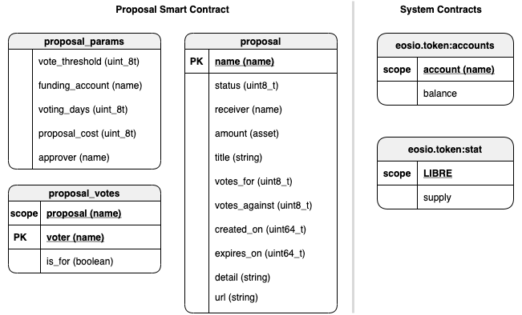

## BTC Libre Governance

The system works as a decentralized voting mechanism set up in the rules governing the blockchain, where budgets for specific projects are proposed and funded once they receive sufficient votes from token holders.

Token holders can create a proposal to be paid in Bitcoin. The cost of creating a proposal is **50,000 SATS** users must also hold a minimum of **1,000 LIBRE** balance in order to submit a proposal.

Active proposals will be voted on by LIBRE token holders who can vote for or against proposals during a **10 day** voting window. Token holders can vote with a voting wight that corresponds to their balance.

All proposals are subject to a 10 day voting period, and any address with voting power can vote for or against the proposal. If a majority, and at least 10% of circulating supply votes are cast for the proposal, it is queued for approval, and can be executed or flagged and canceled.


# Contract Data Model



# Contract Actions

|   User Role    |     Action     |                   Description                   |                                 Pre Conditions                                 |           Post Conditions            |
| :------------: | :------------: | :---------------------------------------------: | :----------------------------------------------------------------------------: | :----------------------------------: |
|    Proposer    |    `create`    |              Create a new proposal              |                         Account must hold `1000 LIBRE`                         |     Proposal is created as draft     |
|    Proposer    |   `transfer`    |             pay for a new proposal              |                    Account must pay cost of a new proposal                     | Proposal is set as active for voting |
|     Voter      |   `votefor`   |           Vote for an active proposal           | proposal must be active , voter must be registered and have a non-zero balance |       Vote for count increases       |
|     Voter      | `voteagainst` |         Vote against an active proposal         | proposal must be active , voter must be registered and have a non-zero balance |     Vote against count increases     |
|    Approver    |   `approve`    |               Approve a Proposal                |                          Proposal must have succeeded                          |         Proposal is executed         |
|    Approver    |    `reject`    |                Reject a Proposal                |                          Proposal must have succeeded                          |         Proposal is executed         |
| Smart Contract | `countvotes`  | Count votes to determine if a proposal succeeds |                   Proposal must have completed voting window                   |  Proposal is approved or cancelled   |

## Proposals

Proposals are executable code as a funds transfer to the receiver account.  


### notes :
- avoid need for a database 
- auto generate names for proposals

### Proposal Fields

- Proposer Account
- Proposal Name
- Proposal Detail
- Proposal Amount in Sats
- Account to be Paid

### Proposal Status

```
  DRAFT = 1
  ACTIVE = 2
  SUCCEEDED = 3
  DEFEATED = 4
  CANCELED = 5
  COMPLETED = 6
```

### Proposal Cost

In order to prevent spam and ensure only serious proposals make it to this stage. a registration fee of **50,000** sats must be paid for any proposal to be created. The funds obtained from proposal costs will be deposited to the `funding` account where funds will be distributed from for all proposals.

A transfer needs to include the proposal name in the memo field for the system to pick up the payment and set a proposal from draft to active.

### notes :

- This would be done with smart contract notify?
- How would we handle transfers with invalid memo fields? reject transfers similar to evodex.
- Consolidate draft and payment actions in order to simplify user experience.

## Voting

BTC Libre is managed by a decentralized community of LIBRE token holders who propose and vote on projects for the network.

### Voting period

All proposals are subject to a 10 day voting period, and any address with voting power can vote for or against the proposal. If a majority, and at least 10% of circulating supply votes are cast for the proposal, it is queued for approval, and can be executed or flagged and canceled.

### Voting Threshold

10% of the circulating supply must vote in order for a proposal to be eligible for acceptance. If more than 50% of token s vote in favor the proposal succeeds.

## Proposal Approval

For vote counts account balances must be read from the last known balance of accounts when the voting window is over. This in order to prevent users from voting , then transferring funds and voting again.

### Proposal Execution

### Proposal Cancellation

## About Edenia

<div align="center">
	<a href="https://edenia.com">
		
	</a>
</p>

[](https://twitter.com/EdeniaWeb3)


</div>

Edenia runs independent blockchain infrastructure and develops web3 solutions. Our team of technology-agnostic builders has been operating since 1987, leveraging the newest technologies to make the internet safer, more efficient, and more transparent.

[edenia.com](https://edenia.com/)
